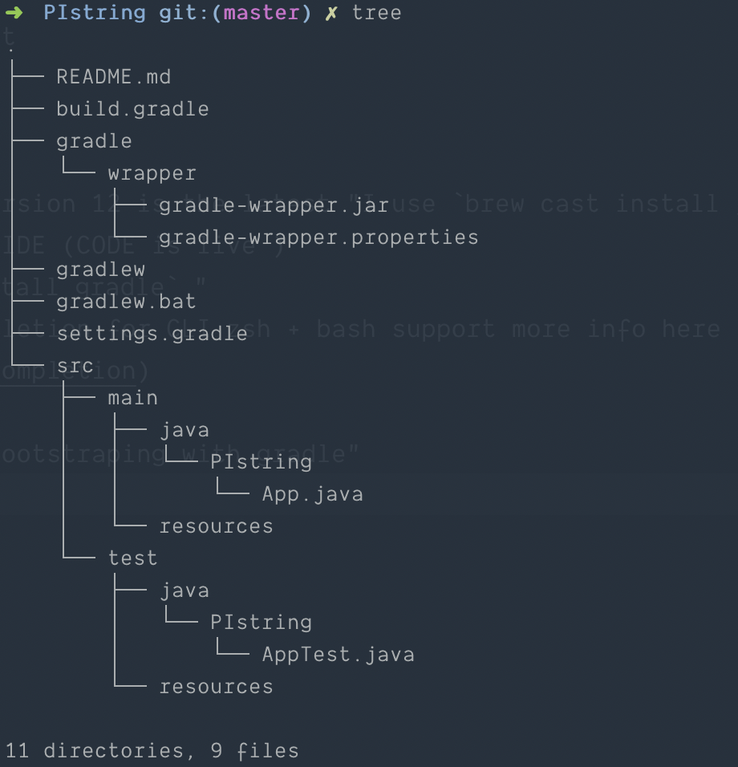

# PIthon

Restful API using Spring Boot

# What you need

- Java Platform (JDK) ... version 12 is the latest "I use `brew cast install java` "
- A favorite text editor or IDE (CODE is live )
- Gradle 4+ "I use `brew install gradle` "
  - brew install gradle-completion for CLI zsh + bash support more info here -> (https://github.com/gradle/gradle-completion)

after installing java and "bootstraping with gradle using `gradle init` " we get this dir tree automacly installed for us :

